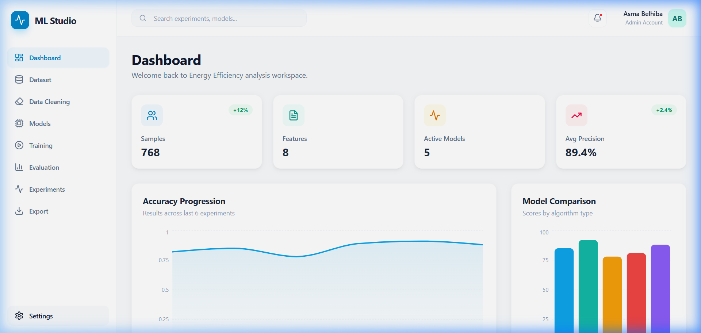
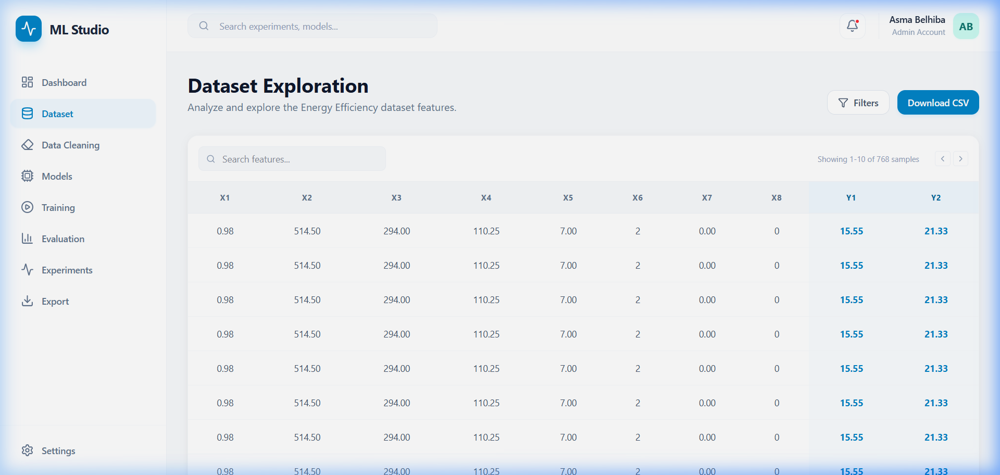
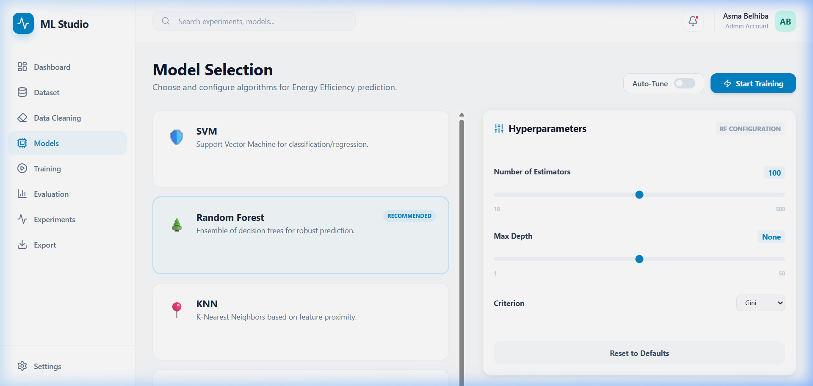
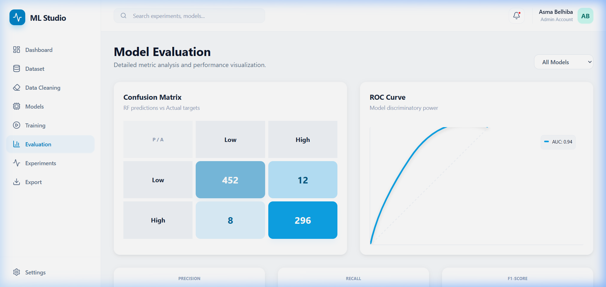

# 🚀 ML Studio: Energy Efficiency Dashboard

ML Studio is a modern, ergonomic, and professional Machine Learning dashboard built with **React**, **Tailwind CSS**, and **Recharts**. It is specifically designed to explore, clean, and model the **Energy Efficiency Dataset** from the UCI Machine Learning Repository.

  

## ✨ Features

### 📊 1. Intelligent Dashboard
- **Quick Insights**: Real-time summary cards for dataset statistics.
- **Interactive Visualizations**: Progress charts and model comparison bars.



### 🔍 2. Dataset Exploration
- **Smart Data Table**: Explore the Energy Efficiency dataset.
- **Statistical Analysis**: Feature distributions via histograms.



### 🤖 4. Model Laboratory
- **Algorithm Variety**: SVM, Random Forest, KNN, and more.
- **Hyperparameter Tuning**: Intuitive sliders and tuning options.



### 📈 5. Evaluation & MLOps
- **Performance Metrics**: Precision, Recall, and F1-Score analysis.
- **Visual Analytics**: Confusion Matrix and ROC Curves.



### 🧹 3. Data Cleaning Suite
- **Preprocessing Tools**: Handle missing values, remove duplicates, and apply feature scaling (StandardScaler, MinMaxScaler) with a few clicks.
- **Dynamic Selection**: Easily select input features and target variables (Heating/Cooling Load).

### 🤖 4. Model Laboratory
- **Algorithm Variety**: Choose from SVM, Random Forest, KNN, Logistic Regression, and Multi-layer Perceptrons.
- **Hyperparameter Tuning**: Fine-tune your models with intuitive sliders and toggle buttons for Auto-Tuning (Grid/Random Search).

### 📈 5. Evaluation & MLOps
- **Performance Metrics**: Detailed breakdown of Precision, Recall, and F1-Score.
- **Visual Analytics**: Interactive Confusion Matrix and ROC Curves.
- **Experiment Tracking**: Full history of training sessions with versioning and quick rollback capabilities.

### 📥 6. Export Center
- **Artifacts**: Download trained models (Pickle), raw results (CSV), and visual reports (PNG/PDF).

## 🛠️ Tech Stack

- **Frontend**: React (Vite), Tailwind CSS (v4), Framer Motion.
- **Visualization**: Recharts, Lucide React (Icons).
- **Backend (Compatible)**: Designed to work with FastAPI/Flask endpoints.

## 🚀 Getting Started

### Prerequisites
- Node.js (v18+)
- npm or yarn

### Installation

1. **Clone the repository**:
   ```bash
   git clone https://github.com/AsmaBelhiba/ML-Studio.git
   cd ML-Studio
   ```

2. **Install dependencies**:
   ```bash
   npm install
   ```

3. **Run the development server**:
   ```bash
   npm run dev
   ```

4. **Build for production**:
   ```bash
   npm run build
   ```

## 📂 Project Structure

```text
src/
├── components/     # Reusable UI components (Sidebar, Header, Layout)
├── pages/          # Individual page views (Dashboard, Dataset, etc.)
├── services/       # API integration layer
├── assets/         # Images and global styles
└── App.jsx         # Main routing and app entry
```

## 🤝 Contributing

Contributions are welcome! Feel free to open issues or submit pull requests.

## 📝 License

Distributed under the MIT License. See `LICENSE` for more information.

---
Developed with ❤️ by [Asma Belhiba](https://github.com/AsmaBelhiba)
